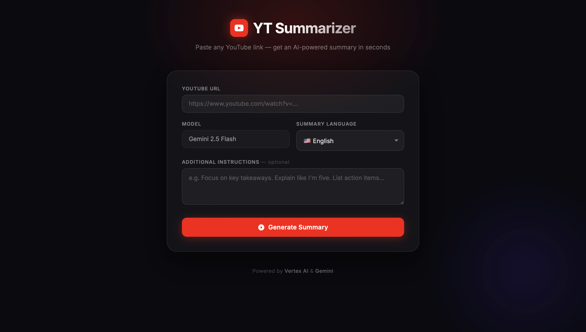
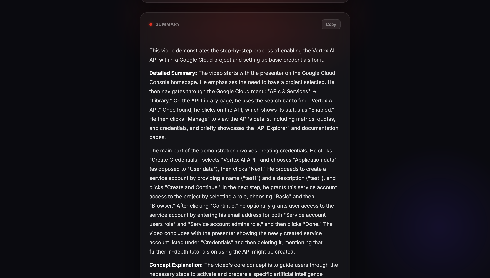

# YouTube Summarizer

An AI-powered web application that generates instant summaries of YouTube videos. Built with Flask and Google Vertex AI, deployed on Cloud Run.

> Developed as part of **Google with AI — Session 1**.

---

## Live Demo

> Deployed on **Google Cloud Run**
> 🔗 [https://yt-summarizer-vertexai-738398904261.us-central1.run.app](https://yt-summarizer-vertexai-738398904261.us-central1.run.app)




---

## Description

YT Summarizer allows users to paste any YouTube link and receive a structured, AI-generated summary in seconds. The application supports 10 languages and accepts optional custom instructions to tailor the output (e.g. "summarize for a non-technical audience").

---

## Tech Stack

| Layer | Technology |
|---|---|
| Frontend | HTML, CSS, JavaScript |
| Backend | Python 3, Flask |
| AI Model | Gemini 2.5 Flash |
| AI Platform | Google Vertex AI |
| Deployment | Google Cloud Run |
| Containerization | Docker |

---

## Service Architecture

```
┌─────────────┐       HTTPS        ┌─────────────────────┐       API Call       ┌──────────────────────┐
│    Browser  │ ────────────────▶  │  Cloud Run (Flask)  │ ──────────────────▶  │  Vertex AI (Gemini)  │
│             │ ◀────────────────  │                     │ ◀──────────────────  │                      │
└─────────────┘     Summary JSON   └─────────────────────┘    Generated Text    └──────────────────────┘
```

1. The user submits a YouTube URL, language preference, and optional instructions via the frontend.
2. The Flask backend constructs a multimodal prompt and sends it to the Vertex AI API along with the YouTube video reference.
3. Gemini 2.5 Flash processes the video content and returns a natural language summary.
4. The summary is rendered directly on the page without a full reload.
